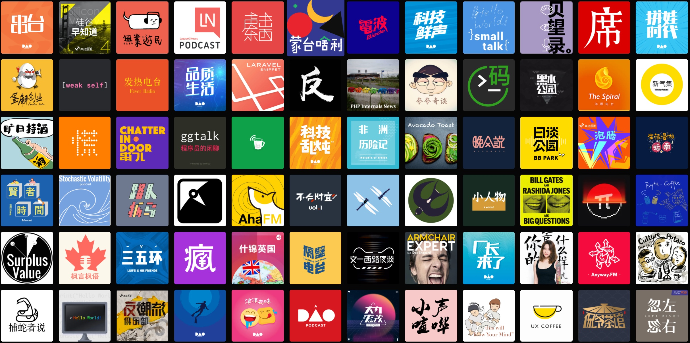

## 引子

好久没写博客了，有点手痒，想了想就写一篇关于播客的吧。
从 18 年开始有了听播客的习惯，最早关注的播客是《津津乐道》。再早之前也曾听过几个节目，比如最近开始复更的《Teahour》早期关于工程师的一期，当时对播客这个概念很陌生，播客对我也没有多少吸引力。
再到后来一次开车赶路途中，心血来潮听了津津乐道有一期关于 ‘伪科学’ 的节目，突然感觉：咦，这玩意有点意思。

## 工具控

### Podcast
iOS 用户知道播客这个东西后，一般都会使用 Podcast App 听播客，但后来感觉这玩意体验很不好，其中最令人讨厌的地方是操作层级太深了，比如，我在发现新的播客后，会习惯性地翻一遍主播的历史节目，每次都要在多个 tab 里切好几遍才能找到历史节目列表，很令人抓狂。

### Overcast
后来从津津乐道的节目介绍中知道了原来还有泛用性播客客户端这东西，基于 rss 订阅，这玩意儿对程序员来说熟悉的很呀。搜罗了一下找到了 Overcast 这个 App，功能简单，页面粗犷，但它有两个特性我非常喜欢：
- Smart Speed，自动压缩没有声音的时长
- Voice Boost，放大主播声音

尤其是后者，早期很多播客的制作品质并不高，主播声音经常被背景音或其他杂音盖过。
用了一年后，甚至订阅了 Premium 支持它，最终还是放弃了，因为真的是太粗犷了，播放列表和订阅列表放在同一个页面，订阅多了之后，只能靠搜索，每次使用都影响心情。

然后开始寻找其他替代 App
- 又尝试了一下 Podcast App，然后果断放弃
- Castro，Overcast 免费提供的两个特性，在 Castro 里是需要付费的，感觉吃相不好看，放弃
- 最终试用了 Pocket Casts，很不错

### Pocket Casts
使用 Overcast 之前也发现了这个 App，但在国区貌似无法安装，当时不太想折腾也就跳过了，再次尝试发现真香：
- 首页订阅列表，每行四个播客 icon，查找播客很方便
- Filter 支持更多筛选条件，左右滑动加到播放列表顶部/底部，每次操作都令人愉悦
- Overcast 提供的两个功能也都在
- 公司产品，迭代频率较高
- 统计功能，满足自己小小的虚荣心

果断订阅 Plus 支持了，截止目前，在 Pocket Casts 收听总时长已经接近八天了。

## 播客推荐

顺序大概按喜爱程度+订阅时间。

### 津津乐道

内容覆盖 TMT、旅游、健康、美食、装修、新消费等领域，主播和嘉宾们都是有丰富业内经验的牛人，风格轻松愉快，讲解由浅到深，偶尔也有些硬核内容，十分推荐。

### 疯投圈

新消费领域的两位投资人，为大家讲解生意。

### 一派 Podcast

经常会在 Apple 苹果发布会当晚深夜录制简评节目，祝努力的人都有好运气！
访谈节目嘉宾都很有意思，比如最近禅修节目中的 XMind 创始人。

### Teahour、牛油果烤面包、内核恐慌、捕蛇者说

IT 从业者适合听的节目，部分节目超级硬核。
最近印象较深的是内核恐慌的《吟诗的光猫》。
Teahour 更新频率较低，作为古早的播客，能年更也可以作为遗迹来瞻仰了。

### 其他

其他还有非常多优质播客，比如黑水公园、侃爷茶馆、ggtalk、生活漫游指南、声东击西等等，几乎每期都会听，之后可能会单拉出来写两句推荐吧。

