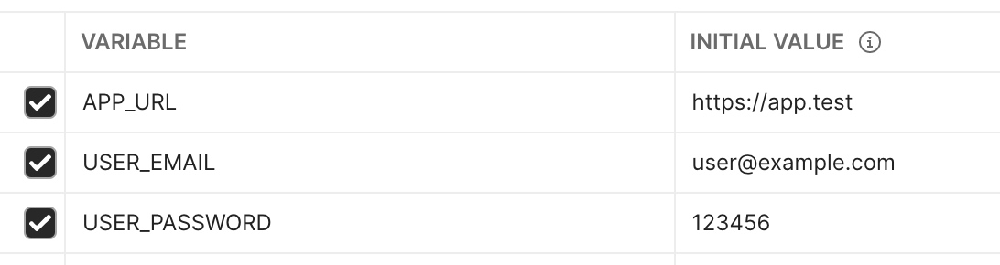
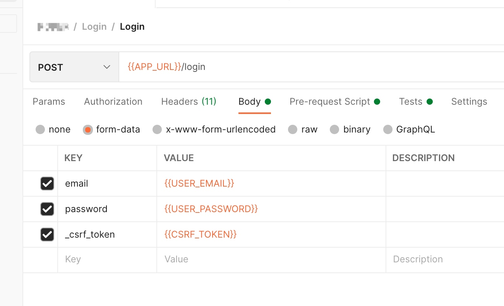

Postman 虽然自带了多种授权方式，但不同项目的登录方式千奇百怪，完全遵照 OAuth 等标准授权协议的项目简直是凤毛麟角。

下面使用 Postman 的 Pre-request Script 实现了 csrf_token 解析，然后与邮箱密码一起发起登录请求。

脚本中使用了多个环境变量，需要切换身份登陆时可以通过切换不同 Environment 实现。用到的环境变量如下：


- `APP_URL` 应用的 base url，便于切换不同环境（local、staging 等），eg: `https://app.test`
- `USER_EMAIL` 登录使用的邮箱
- `USER_PASSWORD` 登陆使用的密码

新建 Request，以下面是登录请求为例：

```
curl --location --request POST 'https://app.test/login' \
    --form 'email="user@example.com"' \
    --form 'password="123456"' \
    --form '_csrf_token="hmXaw7m2Mgyinr7yPHPgPbfVmtH4dOSwOUXykhC0"'
```

在 Pre-request Script 中发起 GET 请求解析 csrf token：

```javascript
// 先清理 cookie (登陆状态)
// 需要预先配置域名到 Whitelist Domains，否则无法使用 Script 清理
pm.cookies.jar().clear(pm.environment.get('APP_URL'), (clearError) => {
    if (clearError) {
        console.log("Clear Cookie Fail", clearError)
        alert(); // 清理失败时让 postman 报错
        return
    }

    
    // 发起 GET 请求，使用正则表达式从 HTML 中解析 csrf_token
    // 某些框架也会将 csrf token 写入 cookie，会更简单些
    // 将解析到的 token 写入环境变量
    pm.sendRequest(
        pm.environment.get('APP_URL') + "/login",
        function (err, response) {
            pm.environment.set(
                'CSRF_TOKEN',
                response.text().match('name="_csrf_token"\ content="(.*)"')[1]
            )
        }
    );
})
```

然后 Body 中使用环境变量读取 csrf token，如下截图，每次发送此 Request 都会开启新的 Session，其他针对 APP_URL 的请求会共享新产生 Cookie。




参考链接
- [Postman JavaScript reference](https://learning.postman.com/docs/writing-scripts/script-references/postman-sandbox-api-reference/)

---

[Paw](https://paw.cloud) 中也可以使用类似的方式实现，不过 Cookie 好像不是共享的，需要使用 `Response Cookie` 来读取 GET 请求产生的 Cookie。
