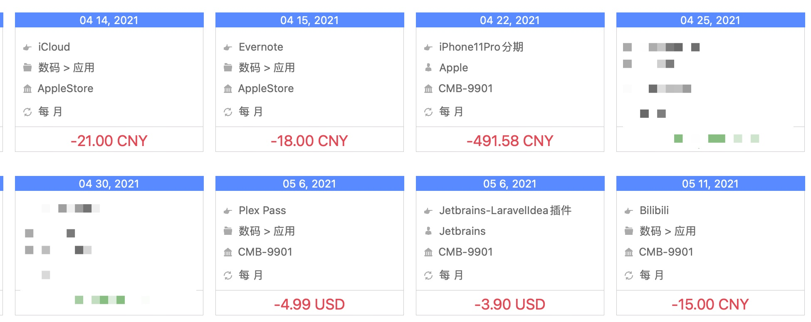
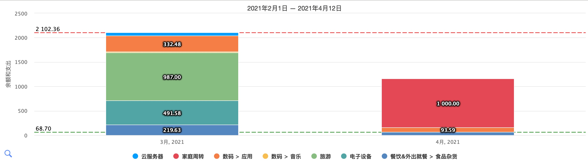
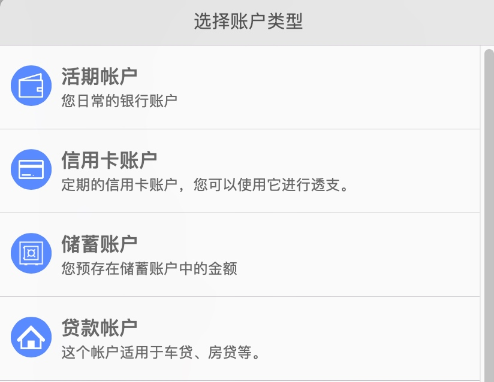
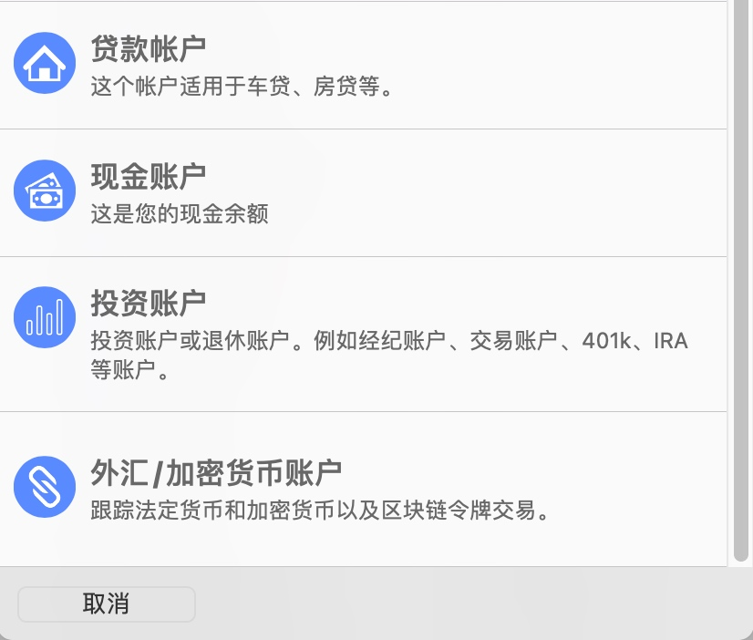

从 3 月份开始精细化记账到现在刚满一个月，记录下个人体验和记账方式。

## 为什么开始记账

### 钱不知道花到哪里去了

对日常开销多少没概念，亲戚家人偶尔会问起 “你在 xx 每个月大概花多少钱？”，(⊙o⊙)… 一脸懵逼的回答 “几千块钱吧”。

买了好多 App，平日里经常收到 AppStore 等订阅平台的账单通知，每月（年）到底需要给这些东西付多少钱？

扫码、刷脸支付一点都不刺激，不知不觉付了很多钱，没了很多没用的东西，扔到家里放很久，然后出闲鱼。

几个月前决定停止使用信用卡，因为每到月末还信用卡时总会肉疼到怀疑人生，停用信用卡后，虽然没不再有还款时那么刺激的体验，但发现银行卡余额再也不涨了，偶尔还会跌 `-_-`，并没有真正解决问题。

### 强烈的购物欲

我是个很容易被种草的人，喜欢听好物推荐的播客，喜欢看新鲜工具的文章，喜欢买各种各样的小工具。陪老婆逛街，最喜欢溜达的是 miniso 这种杂物店，发现新奇的小玩意儿会很开心，然后搬回家。

无聊时偶尔会刷刷京东淘宝的推荐。

远程养了一只猫，本地养了一个娃、一个贤妻，给 Ta 们买东西时会很开心。

记账应该能稍微控制一下购物的欲望。

## 怎样记账

工具控又开始列用过的软件了！

### 之前用过

**多多记账**

最早使用的记账 App，支持纯文字或语音记账，自动识别分类，对懒人很友好。缺点是只能靠人工录入，并且只有移动端，记账效率低。

**随手记**

缺点和多多记账一样，支持多个账本，长期用来记一些低频事件的账务，比如理财的转账记录、娃收的红包等等。

**效率控**

用其中的【订阅管理】功能统计订阅的 App、付费服务等。

### 现在用的

MoneyWiz，UI 算不上精美，但很实用，单次记账操作要比多多、随手记麻烦很多，但有很多优点：

**支持 CSV 导入导出**

对一个数据洁癖患者来说，原始数据能掌握在自己手里的感觉非常棒，就像写文字时喜欢用 MarkDown 一样。能导出就意味着：我可以随时抛弃它迁移到任意平台，历史数据不会丢失。

CSV 导入也是一个非常关键的功能，并且它的导入功能也非常灵活，支持做列映射。MoneyWiz 支持从很多银行自动导入账单，但毫无悬念的是不支持国内银行，CSV 导入功能在一定程度上弥补了这个损失，我写了几个简单的脚本解析银行月账单生成 CSV 格式文本，然后导入 MoneyWiz，节省了很多人力录入的时间。

**支持预定消费或收入**

用来记录订阅费用再适合不过了，另外也可以为周期性的收入（工资等）设置预定。预定支持自动支付或者非自动支付，在记账过程中这两种机制能带来非常美妙的体验，既能覆盖无脑入账的场景，也能给记账者一些掌控感。

- 自动支付，可用在人民币自动扣费、苹果设备分期、房贷等金额固定、自动扣除的场景。
- 非自动支付，当遇到外币扣费时，经过人工确认下会更合适，因为汇率时刻都在变化，很难保证扣费时的汇率和记账的汇率完全一致。

**自定义报表**

内置了很多不同维度的报表，但最令我欣喜的是支持自定义报表（可能是程序员角色对自定义、可编程有超乎寻常的迷恋）

下面报表虽然看起来支持简单的消费类别柱状图，但制作时排除了几个固定支出类别和账户，因此我在记账时不用担心被某些固定/意外支出影响。

**预算**

支持做预算，现在只做了贷款预算，再一个月后准备做些消费预算等，这样可以就可以用到 MoneyWiz 的历史预测特性了！

**其他亮点**

- 转账操作，多个账户之间的转账不计为支出或收入，所以可以为将基金、储值卡等设置成一个单独的账户。
- 加密货币，这好像是 MoneyWiz 的一大卖点，可惜我用不到。
- 支持对账，可以结合预定一起使用。
- 全平台支持。
- SetApp，嗯！我是个 SetApp 订阅用户。

### 什么时候记

虽然是精细化记账，但并不打算每天记一次，因为实际体验下来，使用 MoneyWiz 时，记一笔和十笔花的时间差不了多少：打开 App、查消费记录然后录入。

目前我的日常支出会用到两张卡一张信用卡、一张储蓄卡，两者记账时间点也不同

- 信用卡，重新启用了信用卡，日常消费时优先使用信用卡，招行每月账单到期时会发送账单明细到邮箱，虽然格式比较奇葩，但还是能解析的，生成 CSV 后能节省非常多时间，只需要人工修正下消费分类。
- 储蓄卡，日常很少使用，最长每周记录一次账，每次付款时招行都会发送通知邮件，处理邮件这种事再得心应手不过了。

### 后记

开始精细记账后，凭借自己写的一些小脚本也没有花费太多时间，看到一笔笔明细进入账本，成就满满。到目前总共一个月多点，还没有太多感想，时间长一些后再来更新。