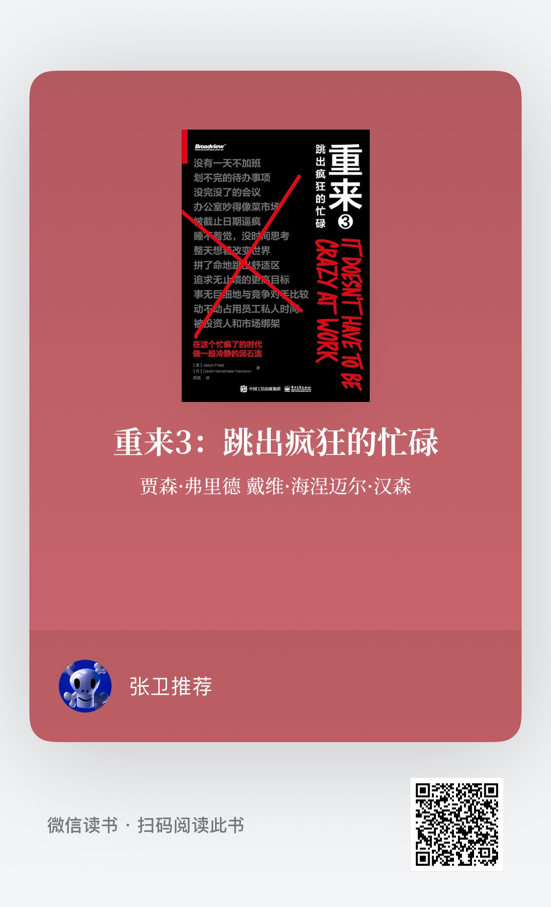

重来3：跳出疯狂的忙碌
贾森·弗里德 戴维·海涅迈尔·汉森
9个笔记

◆ 边走边摸索

+1s
> 要想把舵掌稳，那就在前行中及时做出微调，一千次也不怕，这肯定比一上来就猛打几次舵轮强得多。

◆ 信任犹如电池

> 当员工刚进公司时，这个电池的电量是50%。此后，你每跟他打一次交道，你们之间的这节信任电池就要么充电，要么耗电，具体取决于你是否能兑现承诺的事。

◆ 低处的果子未必摘得到

> 把一项不熟悉的任务比作长在低处的果子，基本上只能说明你对要做的事情一点儿都不了解。

◆ 不做薪酬谈判

> 我们许下承诺，万一有一天我们把公司卖掉了，我们就拿出收益的5%来分给现有的全体员工。不必追看股价，不必担心估值。

◆ 群聊的害处

> “在少数情况下实时沟通，在大部分情况下不必”，以及“如果这件事很重要，那就慢慢来”。

◆ 逼死人的截止日期

> 固定的截止日期，可变的工作量

◆ 完成比完美更重要

> 完成比完美更重要

◆ 故意放弃

> 我们从第一天起，就拒绝了按人数收费的商业模式。这不是因为我们不喜欢钱，而是因为我们更加喜欢自由！

