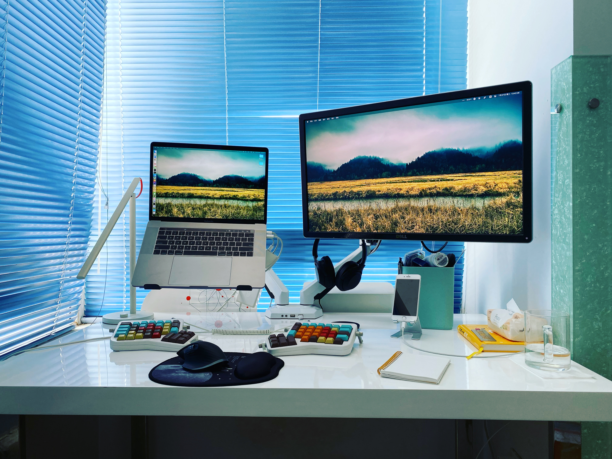
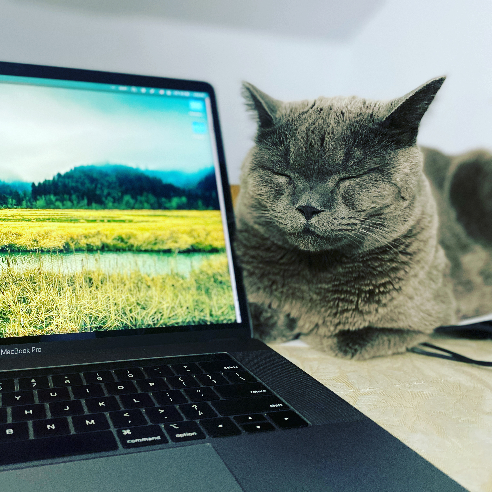
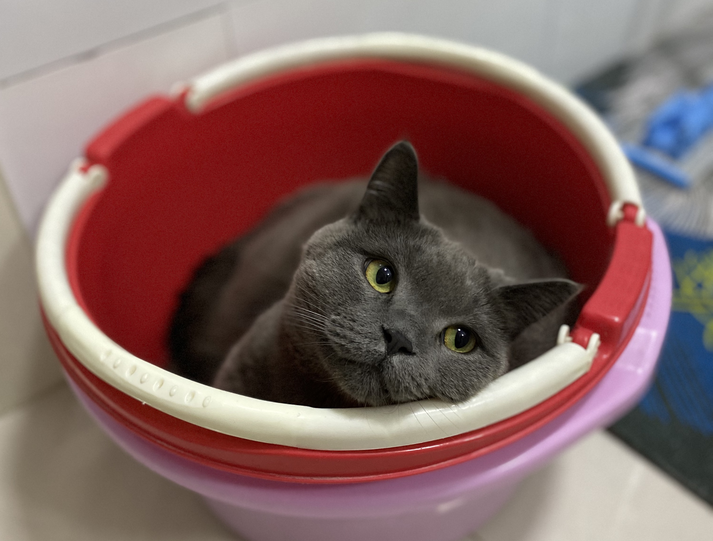

文章主要内容来自 [电鸭社区](https://eleduck.com) 大灰的文字采访，公众号文章链接放在最后。

## 正文

▌介绍下你本人的经历及当前所做的事情吧？

大家好，我叫张卫，目前定居青岛，2016 年初开始远程工作，到现在为止已经有五年了，也算一枚远程老司机。
之前在上海工作了两年，之后有个幸运的机会开始了远程工作，目前主力开发语言是 PHP 和 Python，前端和 App 也写过一些，DevOps 也有不少生产经验，自命为全栈工程师。

▌什么样的契机，让你有了远程的想法？最近的一份远程工作是如何获得的？

比较幸运吧，当时对远程工作基本没有概念。15 年在上海时已经开始考虑回山东工作的事情，但一直没有好的机会和契机，偶然接到了前老大的邀请，承诺在经过一段时间的团队磨合期后可以接受远程工作，于是非常开心地的加入了，16 年初回到青岛开始真正的远程工作。

▌青岛真的是互联网荒漠吗？

是的，所以非常欢迎小伙伴来撩，一起哈啤酒吃蛤蜊。

▌远程之后，工作和生活都发生了哪些变化？

刚开始时有些懒散，每天睡得晚起得晚，作息混乱，工作效率远低于坐班时。察觉到这个状况后开始有意识地调整，和异地的团队老大商量出固定的沟通时间和汇报方式。之后虽然公司技术团队经过了多次大范围变动，我作为技术团队第一名员工（and 唯一远程员工）仍然是开开心心坚持到了最后（真的是最后）。

工作节奏稳定后，生活上并没有太大的区别，但比坐班时冷清了很多，很少有机会约朋友喝酒撸串了，幸好有家人相伴。

生活上有了更多时间和家人相伴，尤其是在有娃之后感触更多，在工作日内相比坐班能以更细的粒度经历小朋友的成长过程：可能是他的一句话、一个表情、一个动作，让人惊喜。

▌你每天的工作的时间和效率是怎么规划和保证的？
 
固定的工作时间和工作地点是必不可少的，个人和团队之间也要保证定期汇报和及时沟通。虽然很多人对远程工作的印象是可以在任何地点工作，我也尝试过在很多地方工作，但效率都不高，现在只有在家里的小屋、关上门、带上耳机能达到工作效率的最高峰。

▌能平时都用到哪些软件/工具来提升效率或者帮助工作呢？

- ErgoDox EZ，上图中的分体式机械键盘，海购，所有按键都可以进行自定义映射，在这之前我一直重度依赖 Filco Minila Air 自带的快捷键，换到 EZ  后在之上重建了一套 Filco Minila Air 一模一样的快捷键。
- Jetbrains 全家桶，码农离不开的坑。
- SetApp，目前用到了 Bartender、Paste、Core Shell、TablePlus、MoenyWiz 等 App。
- G Suite、Slack、Zoom，工作协作工具，来到新公司后发现一个 Slack 的新用法：为每个人建一个个人公开 Channel，每天发些工作记录或者碎碎念，打开时会有同事就在身边的感觉。

▌很多人说远程易孤独，你是如何排解的？

我感觉自己还是比较耐得住寂寞的，孤独感比较弱，无心工作时会刷刷剧、撸撸猫放松下。自从有了娃，完全没有孤独这回事儿了，打开房门和娃玩耍一会儿，非常治愈。

▌对于那些也想开始远程工作的同学，你有什么建议么？

远程工作也是需要付出一些代价的。坐班工作时除去技术层面的成长外，还可能有机会走向管理岗位，但远程是极少有管理岗位机会的，甚至在技术成长层面也会很容易进入吃老本的地步。所以更需要对自己提高要求，更主动地从多方面提升自己。

## 其他版本

- [我是张卫，人在青岛，远程五年啦 | No.24 你好鸭#远程工作者](https://mp.weixin.qq.com/s/Jc0kdw6B_Zy-BCKyIfjfHQ)
- [POPER Interview Remote](https://zhaopin.comiru.cn/article/detail?id=41)
- [社员采访：远程是我的生活方式](https://mp.weixin.qq.com/s/o0ihmDrkr3sKF7-UmHjmug)